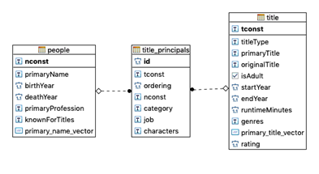

# Further explanation of the approach

Let's explain the three capabilities of the movie chatbot claimed at the Introduction. 
The explanation is divided into Rasa setup, MovieSearchAPI and Database.

## Capability 1:

Retrieve movie(s) that match one or more criteria (director name, actor name, year, genre and rating).

### Rasa setup

- Defined intents: movie_match_director, movie_match_actor, movie_match_year, movie_match_genre, movie_match_several_criteria, movie_match_rating

- Entities: through lookup tables director, actor, genre. To populate the training dataset, the samples retrieved using the IMDB dataset. This dataset has a table with movie ratings that provides the rating and the number of votes for each movie. So, it was decided to sum the number of votes per movie title to retrieve the most known/watched movies and the actors/actresses/directs who participated in these movies.  (see files …)

- Stories: search movie by director, search movie by actor, search movie by year, search movie by genre, search movie by several criteria, search movie with rating

- Form actions: movie_match_director_form, movie_match_actor_form, movie_match_year_form, movie_match_genre_form, action_match_several_criteria_search_movie, movie_match_rating_form

- Custom actions: action_match_director_search_movie, action_match_actor_search_movie, action_match_year_search_movie, action_match_genre_search_movie, action_match_several_criteria_search_movie, action_match_rating_search_movie.

### MovieSearchAPI - endpoint specification: Get Movie given a criteria

Url: GET HOST:PORT/list-movie

Url Parameters (Query Parameters):

genre: the movie genre;

director_name: the movie’s director name;

actor_name: the actor that represents on that movie;

year_start: the year that the movie was released;

year_end: if present, the year_start is mandatory and should behave like a between;

top_rated: number of movies that should be returned, sorted by highest rating.

All of these parameters are optional.

### Database

The available datasets from IMDB, have been chosen to implement the capabilities 1 and 2 since they gather the following needed entities:

- Title.basics - (Movie) titles;

- Name.basics- People (actor, actress and directors);

- Title_ratings- (movie) ratings;

- Title.principals-Relation between titles and people.

Given a large amount of data, the data was imported into a dataset since it would bring more performance of chatbot. For this purpose, a relational database - Postgres - was chosen since it can be easily tuned to answer any query in a timely manner [1] (1 second). The application ETL used was the Python SQLAlchemy library [2] to create and managed the tables listed above.

**Database tuning**

To improve query performance, it has been found that for this project, some data would have not been necessary, and should be discarded. There was a need to clear and shorten the dataset as it contains, for example, series episodes. Thus, for this purpose, titles other than films were not considered. As well as all people and ratings not linked to any of the films that resulted from the previous dataset cleanup. Also, it has been decided to merge the rating column to the title table, once its relation is one-to-one.
Besides this data shrunk, resulting in a smaller amount of data, two full-text-search indexes have been created (Generalized Inverted Index)[1] on two columns: name of (movie) title and name of people (actors, actresses and directors), to make name search faster.
After all this data processing, the entity-relationship model is the following:

 

## Capability 2:

Answer general questions about movies.

### Rasa Setup

- Defined intents: get_director_by_movie_title, get_actor_by_movie_title, get_year_by_movie_title, get_genre_by_movie_title, get_rating_by_movie_title

- Entities: through lookup table movie title (see files …)

- Stories: search director with movie title, search actor with movie title, search year with movie title, search genre with movie title, search rating with movie title

- Form actions: get_director_by_movie_title_form, get_actor_by_movie_title_form, get_year_by_movie_title_form, get_genre_by_movie_title_form, get_rating_by_movie_title_form

- Custom actions: action_get_director_by_movie_title, action_get_actor_by_movie_title, action_get_year_by_movie_title, action_get_genre_by_movie_title, action_get_rating_by_movie_title.

### MovieSearchAPI - endpoint specification: Get Movie Information given its title

Url: GET HOST:PORT/movie-info
 
Url Parameters (Query Parameters):

movie_title: the movie title we want to obtain information

### Database

See Database capability 1

## Capability 3

Suggest movies based on their characteristics.

### Rasa setup

- Defined intents: get_movie_attributes

- Entities: through lookup tables  of movie_attribute

- Stories: search for movies based on its attributes

- Form actions: get_movie_based_attribute_form

- Custom actions: action_get_movie_based_attribute

### MovieSearchAPI  - endpoint specification: Get Movie given an attribute

Url: GET HOST:PORT/movie-with-attribute

Url Parameters (Query Parameters):
genre: the movie genre;

movie_attribute: the characteristic of the movie;

director_name: the movie’s director name;

actor_name: the actor that represents on that movie;

year_start: the year that the movie was released;

year_end: if present, the year_start is mandatory and should behave like a between;

top_rated: integer representing the number of movies that should be returned, sorted by highest rating.
All of these parameters are optional.

### Database

For this stage, the corpus was composed by plots summaries (from cmu database) and movie reviews (from kaggle database). To all these documents, a text processing pipeline was applied to clean the text in order to reduce the vocabulary (Case folding, Special chars cleanup, Tokenization, Stop word removal, Stemming). For all the plots and reviews, it was created an inverted index. Conceptually, the index will consist of rows with one word per row and each entry should be another dictionary by document id with a list of word positions in that document. Next, each document (plot/review) in the corpus were represented as a word vector. The value of a word in a document was calculated recurring to TF-IDF metric, where the TF represents the relative frequency of the term in the document and IDF, the logarithm base 10 of the inverse document frequency.

After, the retrieval method search for the query words (input movie_attribute) in the inverted index and use the TF-IDF to score each match and allow ranking.

Before searching the query words, it was done a  sentiment analysis on the movie attribute with the aim of identifying and extracting opinion based on attitude, sentiments and emotions of the user of the bot, to get the better attainable movie response. For that purpose, Vader Lexicon from NLTK python library was used. After identifying the sentiment of the query, the search was done as follow:

- If the sentiment is negative: search on inverted index calculated on kaggle database negative reviews;

- If the sentiment is positive:  search on inverted index calculated on kaggle database positive reviews

- If the sentiment is neutral:  search on inverted index calculated on cmu database plot summaries

